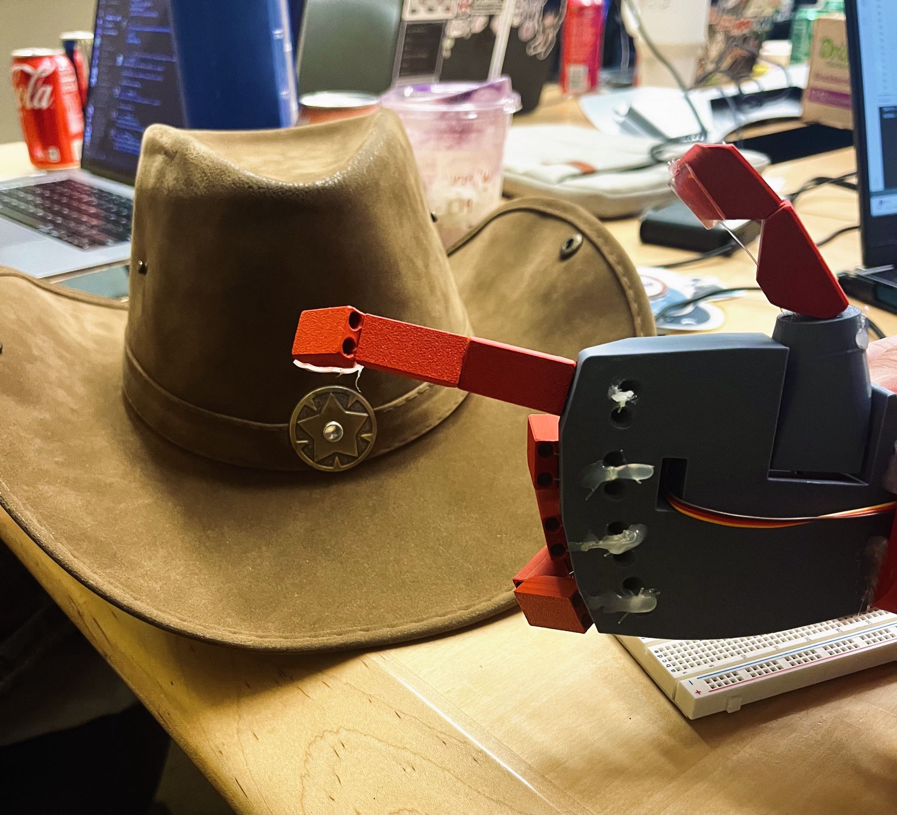

# Welcome to Big Iron! 🤠
The Quickest Prosthetic in the Wild West! (Computer Vision Prosthetic Limb)
<p align="center">
  
</p>

Official "HooHacks 2026" Submission for: Ayan Rasulova (GitHub: ayanrasulova), Emilie Deadman (GitHub: echiino), Amelia Chen  (GitHub: ameimeilia), Jack Ellis (GitHub: jackawackadoo)

Video Demo [Here](https://www.youtube.com/watch?v=ZUayejgblIs): 

## Our Inspiration:

A lot of our previous projects have involved tools for accessiblity. We noticed that a lot of modern prosthetic limbs typically average in the ~thousands, depending on complexity. We wanted to see if, with a very low budget, we would be able to create a much cheaper alternative (<$40) using computer vision. In doing so, we can help empower those who might need such a device but lack the funds to acquire one, for example, a child born without a hand who will be constantly need to upgrade the size of their prosthetic.
## Features:

When our computer vision model detects an item from its object library, it composes a packet of data and sends it to an arduino nano over UART. This packet contains all the necessary data to move and contract the fingers on Big Iron. The arduino then interacts with 6 servo motors to move the hand accordingly. The computer vision model takes advantage of its understanding on how a human hand would interact with certain objects to produce a natural and effective motions in the prosthetic.

## Challenges and What We Learned: 

A lot of the difficulties we faced during this project involved power supply issues with our servo motors, especially because only one of us has a background in computer engineering, so many of us had to teach ourselves new skills for this project. When we used YOLOv5's default classifications, we were having some issues with accuracy in terms of false classifications and instability (as well as not supporting classifications for certain items, such as our cowboy hat), so we had to fine-tune the model in order to recognize our target items.

## Future Plans 

With a slightly larger budget, we could implement more movement, such as with the wrist or forearm. 

## Run Instructions
**You must be using Python 3.11 for the necessary libraries to work** 

First, you must install all the correct dependencies in a virtual environment using our install script: 

```
# create venv (if mac do python3)
python3.11 -m venv yolov5-env

# activate (on mac do source yolov5-env/bin/activate)
yolov5-env\Scripts\activate

# install requirements
python install.sh
```

Then, cd to the yolov5 directory, and run the following command to start the webcam:
```
python detect.py \
  --weights prosthetic_arm_weights.pt \
  --source 0 \
  --conf 0.5
# if the webcam is not opening up, change it to --source 1 (or whatever the source of the webcam you are using is)
```
